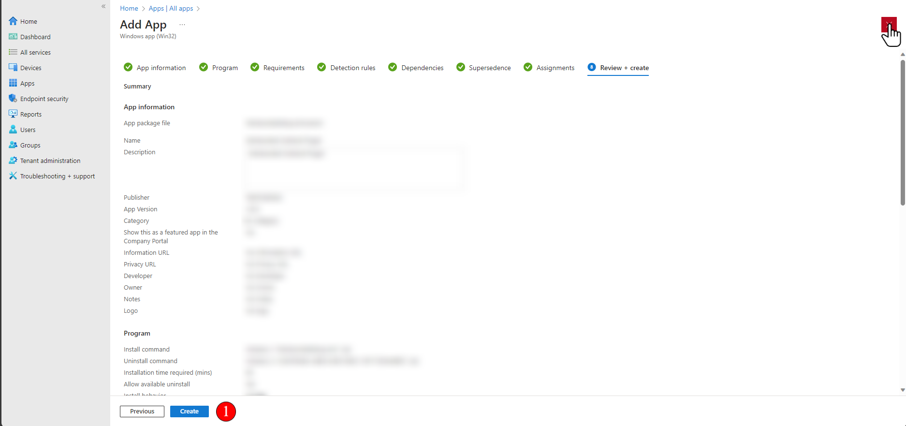

# Upload application to Intune

## Intro

This KB will provide you a step by step guide on how to upload your application to intune.

.png>)

***

## Prerequisite

In this KB specifically, we will be using our previously created .intunewin wrapper.

Article for that will be in the link below



Access to site's Intune.

***

## Step-by-Step Guide

### 1. Adding the file to Intune.

To add application. Go to Apps (1) > All apps (2) > Add (3).

.png>)

Select the drop down (1) > Select your application type (2)

.png>)

Once selected, press Select (1)

.png>)

A new window will appear. Select app package file (1) > Find and select your .intunewin file. (2)

.png>)

Fill in all required \* Input.

Some details will be auto populated. Feel free to make the changes to your liking.

Press Next (1) when you are finished

.png>)

As per previous, ensure any auto populated details are correct. Press next (1) when you are ready to proceed.

.png>)

### 2. Configure the requirement for application to be eligible for install

This page specify the requirements that the hardware must meet before the app is installed.

I have set the operating system architecture to 64-bit only (1) and minimum operating system to Win10 1607 (2) to targe all 64bit devices. You can modify this to your needs.

Once completed. Press Next (3)

.png>)

### 3. Configure your rule item.

Click add (1) > Select the file type for the rule to be triggered (2) > enter your file GUID (3) (the one we extracted in previous KB) > Set version check to No (4) > Press OK when you are done. (5)

Your new rule should be populated in the Type tab. Once it is, Pres Next (6)

.png>)

### Note

Due to the nature of our setup. We will skip Dependencies and Superseded tab. Feel free to read them in your spare time.

### 4. Assign your application assignments

This is where you set assignments on what user, hardware or groups the application is applied for.

For this tutorial, we want to set up the program across all devices. So we will press 'Add all devices (1) > Next (2)

.png>)

Review your configuration and Press Create (1) when you are done!

***

## Outro

Once you have applied the configuration. The application will install on its assigned groups, users, hardware on the next automatic cycle.&#x20;
