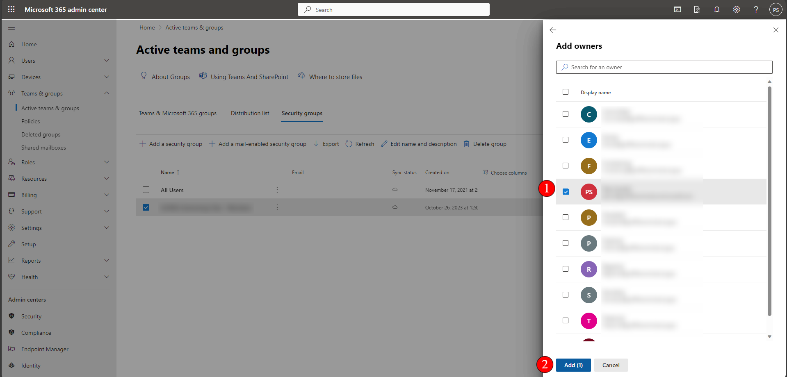

# Set up SharePoint Security Group

## Intro

This KB will provide you a step by step guide on how to create security group on Office 365 Admin Centre.

## Prerequisite:

Admin access on the 365 tenancy.

## Step-by-Step Guide

### 1. Go to Active Team & Groups (1) > Security Groups (2) > Add a Security Group (3)&#x20;

### 2. Enter the name of your group for identification (1) > Next (2)

### 3. Hit Next if the role assignment option is not applicable.

### 4. Confirm configurations are correct and 'Create Group'

### 5. Your Group will appear on the list. Click on it to pull the side window (1) > Add Group Owners (2)&#x20;

### 6. Add all Owner accounts for the group (1). Press Add once completed (2)

### 7. Go to Members (1) > View all and manage members (2)

### 8. Add your members

### 9. Refresh and confirm that the Groups exist and owners + members are listed.

## Outro

This guide should assist you in creating a new security group within the office 365 tenancy.&#x20;
