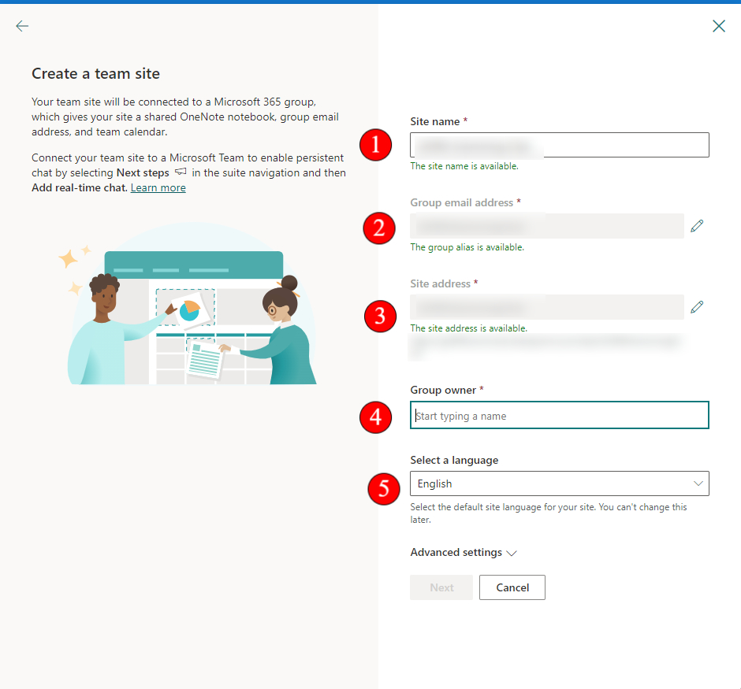

# Set up SharePoint Site

## Intro

In this article we will go through how to set up a sharepoint site.

A sharepoint site allows us to use onedrive as a 'network drive' where authorised users can collaborate and contribute to documents related to their company. As Sharepoint uses OneDrive servers, this also ensure that everything is synced up to the cloud and is ready for access as long as you have internet connection (if files have not been locally saved).

.png>)

### 1. Press Create

.png>)

### 2. The window on your right-hand side will appear.

.png>)

### 3. Fill in the details.

1 - Site Name

2 & 3 - Should be auto populated based off your Site name

4 - Add the Group owners. These users will have full control over the sharepoint site

5 - Select your site's language

<figure><figcaption></figcaption></figure>

### 4. Optional - Advance Settings

This step is optional, but I like to go through them anyway as it may be useful for some:

1 - Configure site with the following permissions

Public : Anyone within the organisation can access it

Private : Only invited members can access it

2 - Set your site's time zone

3 - Set a brief description of your site.

<figure><figcaption></figcaption></figure>

### 5. Press Next once all details are entered.

.png>)

### 6. Add your members (email address) and press Finish when you are done.

Note: There is an alternative way to complete this step that I like using. Click here to access the tutorial.

.png>)

### 7. Press the URL

.png>)

### 8. You will be redirected to the newly created site.

.png>)
