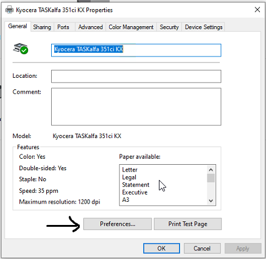
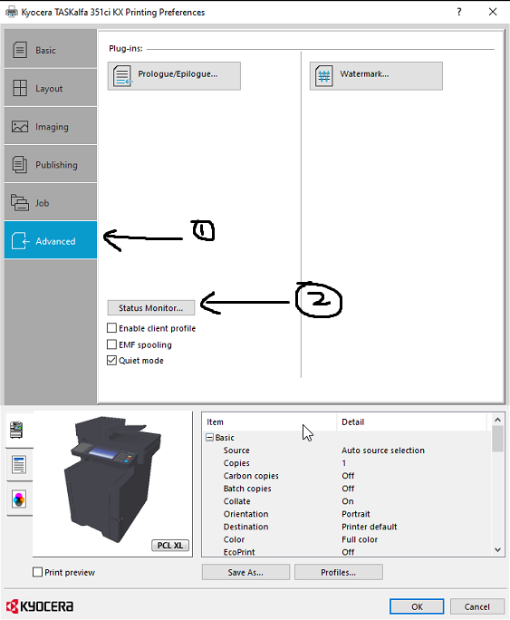
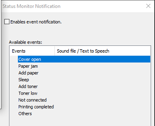

# Kyocera - Turn off Status Monitor

**ISSUE**

Status Monitor constantly appearing when printing.&#x20;

**CAUSE**

Initial printer driver set up had the status monitor option selected.

**RESOLVE**

1. Access your printer driver and press Preferences.

<figure><figcaption></figcaption></figure>

2. Go to Advanced > Status Monitor

<figure><figcaption></figcaption></figure>

4. Untick 'Enables Event Notification'.

<figure><figcaption></figcaption></figure>

4. Save all changes made and youre done!
